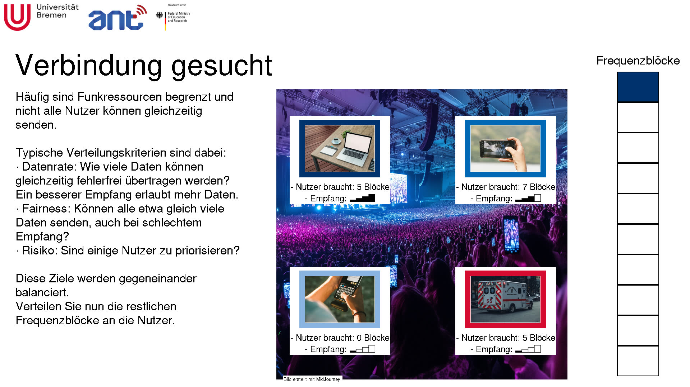

Short demo on resource allocation.
Fork of [https://github.com/Steffengra/2301_SchedulingDemo](https://github.com/Steffengra/2301_SchedulingDemo) with the goal of being more self-explanatory.

The demo GUI is run from `src/analysis/gui.py`.

# Installation
The ML model used in this demo requires an older version of tensorflow.
That version of tensorflow requires a specific python version.
The required packages are listed in `requirements.txt`.

The preferred installation method is:
1. Set up a Python3.9 installation
2. Set up a venv based on Python3.9
3. In this venv, install the required packages from `requirements.txt`

Alternatively, setting up a specific python version is easier with conda.
However, this will lead to fonts not rendering as nicely.
1. Set up a Python3.9 conda environment
2. Install the required packages from `requirements.txt` in this conda environment